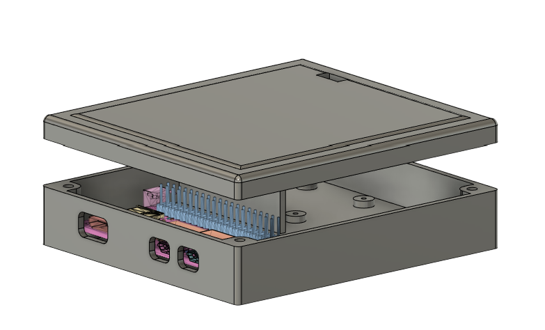
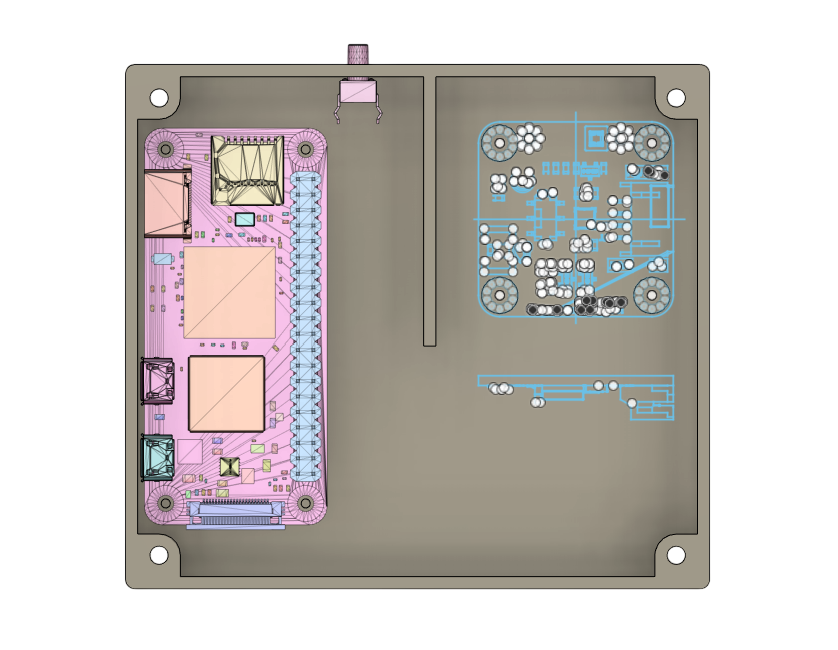
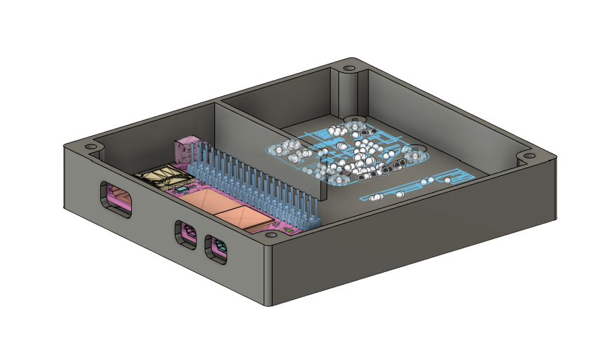
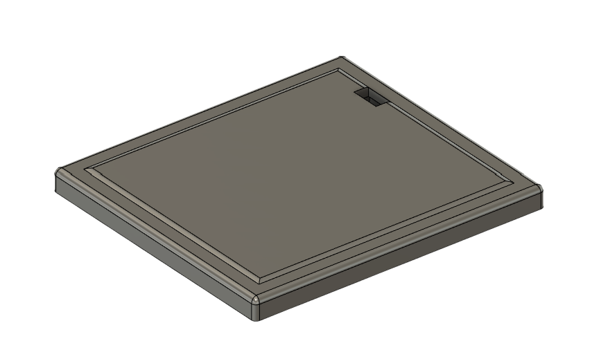

## 3D Printable Enclosure

The Raspberry Pi Zero W and the environmental sensor are housed in a custom-designed enclosure that can be 3D printed using the provided [STL files](https://github.com/TEXTaiLES/Environmental-Condition-Monitoring/tree/master/enclosure).

The enclosure is designed to:

- Provide side openings for direct access to the **micro-USB and mini-HDMI ports**
- Include a dedicated opening for a **reset button**
- Feature a top opening that allows the **light sensor** to measure ambient light accurately
- Allow easy **assemply and dissasembly** for maintenance or prototyping

The following images illustrate the proposed enclosure design:

        
    </a>

        
    </a>

        
    </a>

        
    </a>

