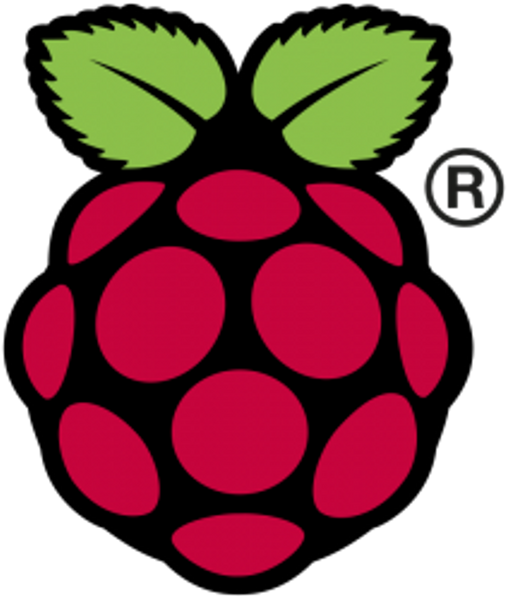
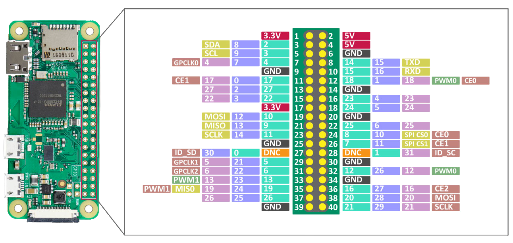

## Basic Installation

The Minimum hardware requirements are:

 - a Raspberry Pi Zero W or every Raspberry Pi that has a build-in WiFi module and supports Linux-Based OS 
 - Recommended OS: [Raspberry Pi OS](https://www.raspberrypi.com/software/operating-systems/)
 - An environmental sensor that captures environmental variables such as [DFRobot Gravity: High Accuracy Temperature, Humidity, Pressure, Ambient Light and UV Sensor](https://www.dfrobot.com/product-2528.html)

### Step 1 - Raspberry Pi OS Installation
Go to the Raspberry Pi Software [page](https://www.raspberrypi.com/software/) and download the Raspberry Pi Imager tool. Proceed with the installation of the OS that meets the hardware requirements.
<p align="center">
    <a href = "https://www.raspberrypi.com/software/" target="_blank">
        
    </a>
</p>

After the installation of the OS, make sure that you have cloned the following repository on your local machine:

```bash
git clone https://github.com/TEXTaiLES/Environmental-Condition-Monitoring
```
- The `code` folder contains the script that enables the measurements via the sensor.

### Step 2 - Wiring
The Raspberry Pi Zero W and sensor pins are depicted in the following images.

<p align="center">
        
    </a>
</p>

<p align="center">
        
    </a>
</p>

To connect the DFRobot Gravity sensor with the Raspberry Pi Zero W, use the following connections:

| Sensor Pin | Raspberry Pi Pin |
|------------|------------------|
| VCC (+)    | 5V (Pin 4)       |
| GND (-)    | GND (Pin 6)      |
| D/T        | RXD (Pin 10)     |
| C/R        | TXD (Pin 8)      |

Important Note: Make use that you select the UART mode on the sensor by moving the switch to the `UART` position.

### Step 3 - Raspberry Pi Setup
After the Raspberry Pi is connected to the sensor and the project folder has been cloned, enter the folder and follow these steps:

1) Install the required libraries:
```bash
bash dependencies.sh
```
2) Once the installation is complete, edit the boot configuration:
```bash
sudo nano /boot/firmware/cmdline.txt
```
Find and remove the part `console=serial0, 115200`. Save the file and exit.

3) Enable UART and disable Bluetooth:
```bash
sudo nano /boot/firmware/config.txt
```
At the bottom of the file, make sure the line `enable_uart=1` is present, and add right above it: `dtoverlay=disable-bt`. After the configuration, reboot the Raspberry device.

4) Open the `prod.py` with a code editor and update the database attributes. After that, run:
```bash
python prod.py
```
and the collected data will be displayed in the terminal after each sampling step.